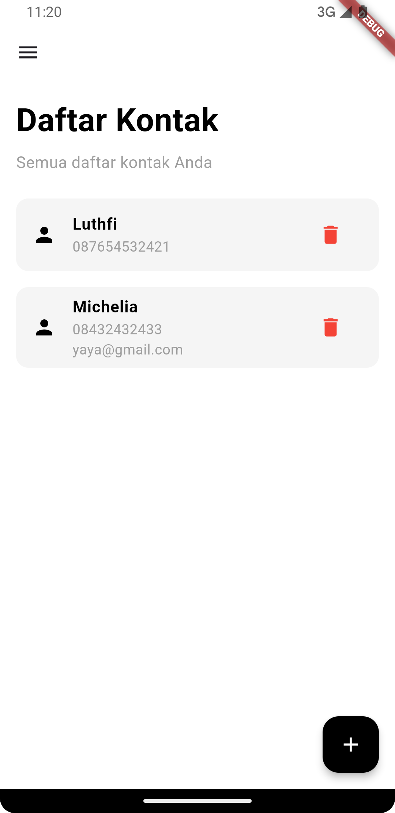

# Tugas Pertemuan 3

- **Nama** : Luthfi Arie Zulfikri
- **NIM** : H1D022061
- **Shift Lama** : A
- **Shift Baru** : A

---

# Aplikasi Manajemen Kontak

## Fitur Login

1. **`TextEditingController _usernameController` dan `TextEditingController _passwordController`**:

   - Digunakan untuk menangkap input dari pengguna di kolom username dan password.

2. **`_showInput` Method**:

   - Membuat widget `TextField` yang di-custom dengan parameter seperti controller, placeholder, apakah ini input password (obscureText), dan ikon.

3. **`_showDialog` Method**:

   - Menampilkan `AlertDialog` ketika pengguna melakukan aksi login, baik berhasil atau gagal. Tombol di dialog ini mengarahkan pengguna ke halaman lain, seperti `HomePage` atau tetap di `LoginPage`.

4. **`_saveUsername` Method**:

   - Menggunakan `SharedPreferences` untuk menyimpan username ke dalam storage lokal, sehingga pengguna bisa login dan tetap tersimpan.

5. **`onPressed` di tombol Login**:
   - Mengecek apakah username dan password benar, jika benar, username disimpan dan dialog sukses muncul, jika salah, dialog error muncul.

## Fitur Manajemen Kontak

1. **`_loadContacts` Method**:

   - Mengambil kontak yang tersimpan dari `SharedPreferences` dan mem-parsing-nya menjadi `List<Map<String, String>>` untuk ditampilkan di layar.

2. **`_addContact` dan `_deleteContact` Methods**:

   - Menambah atau menghapus kontak pada `SharedPreferences`, lalu memuat ulang daftar kontak agar tampilan ter-update.

3. **`TextEditingController` untuk Name, Phone, dan Email**:

   - Kontroller untuk menangkap input dari pengguna terkait informasi kontak yang ingin ditambahkan.

4. **`_showInput` Method**:

   - Sama seperti pada halaman login, berfungsi untuk membuat `TextField` yang menampilkan inputan untuk nama, nomor HP, dan email kontak.

5. **`ElevatedButton` dengan onPressed**:
   - Ketika tombol "Simpan" ditekan, jika nama dan nomor HP sudah diisi, kontak baru akan dikirim balik ke `HomePage` menggunakan `Navigator.pop`, dan disimpan di sana.

## Fitur Logout

1. **`_logout` Method**:
   - Ketika pengguna menekan logout, `SharedPreferences` menghapus username yang tersimpan dan membawa pengguna kembali ke halaman login dengan `Navigator.pushAndRemoveUntil`, menghapus semua halaman sebelumnya dari stack.

---

# Screenshot

  
  

  
  

  

